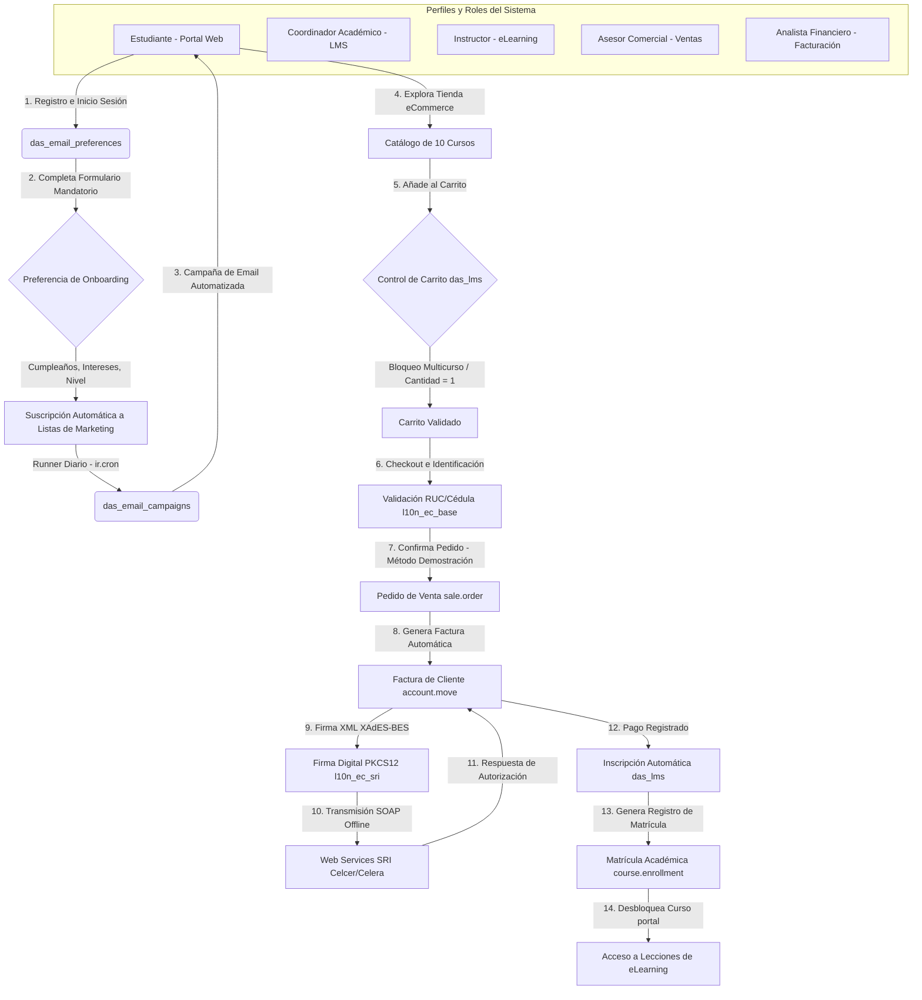

# 🏫 Plataforma Integrada de la "Academia Virtual de Tecnología" (Ecosistema Odoo-DAS)

Bienvenido a la documentación principal de la **Academia Virtual de Tecnología**, una implementación empresarial y académica de alto rendimiento basada en **Odoo 18.0 Community**. Esta solución integra procesos críticos de comercio electrónico, facturación legal ecuatoriana con firma digital XAdES-BES, gestión del ciclo de aprendizaje en línea (LMS) y automatización de relaciones con clientes a través de campañas de marketing por correo electrónico segmentadas.

El proyecto ha sido conceptualizado y desarrollado por los alumnos de Séptimo Nivel "A" de la Carrera de Software de la Universidad Técnica de Ambato en la asignatura de *Desarrollo Asistido por Software*, bajo la tutoría del docente Ing. MSc. Santiago David Jara Moya.

---

## 🎯 Propósito del Proyecto y Contexto Real

El objetivo principal de la **Academia Virtual de Tecnología** es simular y operar un ecosistema empresarial real e integrado en Odoo 18.0. La plataforma automatiza todo el ciclo de captación, retención, compra y entrega de material formativo para profesionales de la tecnología, asegurando que:
1.  **Captación Estratégica**: Todo registro nuevo de estudiante en el portal web active un formulario mandatorio de onboarding de preferencias para segmentar al alumno desde el primer minuto.
2.  **Venta Controlada**: Los cursos se ofrecen en la tienda virtual (eCommerce) como productos de tipo servicio con restricciones académicas que evitan errores en el carrito de compras (ej. compras multicurso o de múltiples cantidades).
3.  **Facturación Legal**: Cada compra realizada genera una factura comercial automática que es firmada digitalmente con un archivo criptográfico PKCS12 (`.p12`) siguiendo el estándar ecuatoriano **XAdES-BES** y transmitida a los servidores offline del **SRI (Servicio de Rentas Internas)**.
4.  **Entrega Académica (LMS)**: El pago exitoso de la factura matricula inmediatamente al estudiante en el canal de e-Learning respectivo, desbloqueando el acceso a lecciones estructuradas basadas en cronogramas reales.
5.  **Fidelización**: Se desencadenan campañas automatizadas de Email Marketing de forma diaria basadas en el perfil de onboarding (cumpleaños, boletines semanales, promociones por nivel y recomendaciones de cursos próximos).

---

## 🗺️ Arquitectura Técnica y Flujo de Datos Comercial

El siguiente diagrama detalla cómo fluyen las transacciones y la información a través de los diferentes módulos del ecosistema Odoo:



---

## 📦 Desglose y Funcionalidad de los Addons Personalizados

El ecosistema de la Academia se divide en módulos modulares y especializados que cooperan de manera integrada:

### 1. Gestión Académica LMS y Tienda (`das_lms`)
Este módulo extiende las capacidades nativas de e-Learning de Odoo (`website_slides`) y comercio electrónico (`website_sale`), aplicando reglas de negocio estrictas:
*   **Vínculo Producto-Curso**: Asocia explícitamente productos de la tienda con canales de diapositivas (`slide.channel.product_id`).
*   **Restricciones de Carrito**: Lógica para bloquear la compra de múltiples cursos en un mismo pedido de venta y limitar la cantidad de venta a una unidad (`product_uom_qty = 1`).
*   **Backfill de Facturas**: Wizard que busca facturas válidas pagadas anteriormente para matricular retroactivamente a los estudiantes si sufrieron caídas de red.
*   **Control de Acceso Temporizado**: Los cursos con estado académico "Próximo" bloquean el acceso a las lecciones de los estudiantes matriculados hasta que inicie oficialmente la fecha registrada.

### 2. Onboarding Estudiante (`das_email_preferences`)
Garantiza que la base de datos de marketing esté segmentada desde el momento en que se crea una cuenta:
*   **Redirección Obligatoria**: Bloquea el portal de Odoo para el estudiante recién registrado hasta que complete sus preferencias.
*   **Perfil Académico**: Captura la fecha de nacimiento, intereses temáticos de TI, formato de curso preferido, nivel de experiencia previa y consentimiento explícito de privacidad.
*   **Sincronización de Suscripciones**: Almacena las preferencias e inscribe de manera inmediata al alumno en las listas de correo correspondientes.

### 3. Automatización de Email Marketing (`das_email_campaigns`)
Motor de envío y automatización de marketing por correo electrónico personalizado:
*   **Frecuencia Controlada**: Permite que el estudiante elija si desea recibir correos de forma semanal, mensual o nunca, bloqueando el envío si el plan supera la frecuencia configurada.
*   **idempotencia Garantizada**: Emplea una tabla de logs `das.email.campaign.log` con llaves periódicas compuestas (`period_key`) por socio y curso para asegurar que nadie reciba correos duplicados.
*   **Runners de Campaña**: 5 automatizaciones diarias (`ir.cron`): Birthday, Novedades de Cursos Nuevos, Alertas de Cursos Próximos, Boletines Basados en Nivel de Experiencia y el Newsletter Periódico.

### 4. Localización y Validación de Identidad Ecuatoriana (`l10n_ec_base`)
*   **Algoritmo Módulo 10**: Valida matemáticamente cédulas nacionales y RUCs de personas naturales del Ecuador, calculando la diferencia del residuo contra el dígito verificador.
*   **Algoritmo Módulo 11**: Valida RUCs de sociedades privadas (tercer dígito = 9) y entidades públicas (tercer dígito = 6) utilizando el multiplicador ponderado.
*   **Validación de Pasaporte**: Acepta estructuras alfanuméricas mayores a 5 caracteres para estudiantes internacionales.

### 5. Facturación Electrónica y SRI (`l10n_ec_sri`)
*   **Firma XAdES-BES**: Realiza la firma digital local de comprobantes XML utilizando certificados PKCS12 (.p12) y el algoritmo SHA1 con RSA de 2048 bits.
*   **Pasarela SOAP Offline**: Se comunica mediante web services offline de recepción y consulta con los servidores del SRI ecuatoriano, extrayendo las tramas de error o autorización fiscal.

---

## 🛠️ Requisitos Técnicos y de Configuración

Para instalar y depurar la plataforma de la Academia de forma local:

### 1. Requisitos de Infraestructura
*   **Docker & Docker Compose** instalado en el host de desarrollo.
*   **Base de Datos**: PostgreSQL 15+.
*   **Python**: Python 3.10+ con librerías `cryptography`, `lxml` y `zeep`.

### 2. Estructura de Addons
Asegúrese de agregar la ruta de la carpeta `addons/` en el archivo de configuración `odoo.conf`:
```ini
addons_path = /var/lib/odoo/addons/18.0,/mnt/extra-addons/das_lms,/mnt/extra-addons/das_email_preferences,/mnt/extra-addons/das_email_campaigns,/mnt/extra-addons/l10n_ec_base,/mnt/extra-addons/l10n_ec_sri
```

### 3. Ejecución en Docker
Inicie el entorno contenerizado ejecutando desde el directorio `docker/`:
```bash
docker-compose up -d
```
El servidor Odoo estará accesible en `http://localhost:8070` (o el puerto configurado en su compose).

### 4. Test Suite Automatizado
Para ejecutar todas las pruebas unitarias y de integración de los addons de Odoo-DAS, corra el siguiente comando:
```bash
python odoo-bin -c config/odoo.conf -i das_lms,das_email_preferences,das_email_campaigns,l10n_ec_base,l10n_ec_sri --test-enable --stop-after-init
```

---

## 📖 Directorio de Documentos Detallados del Proyecto

Toda la documentación ampliada de negocio, desarrollo, APIs y pruebas se encuentra clasificada en la carpeta [docs/](file:///c:/Users/johan/OneDrive/Documentos/Universidad/Desarrollo%20Asistido%20por%20Software/OdooLeonel/Odoo-DAS/docs):

1.  **Guía de Usuario Funcional**: [Manual de Usuario - Portal y LMS](file:///c:/Users/johan/OneDrive/Documentos/Universidad/Desarrollo%20Asistido%20por%20Software/OdooLeonel/Odoo-DAS/docs/user_manual.md) - Manual paso a paso para estudiantes y flujos del portal.
2.  **Guía Técnica de Desarrollo**: [Guía de Desarrollo y Arquitectura](file:///c:/Users/johan/OneDrive/Documentos/Universidad/Desarrollo%20Asistido%20por%20Software/OdooLeonel/Odoo-DAS/docs/developer_guide.md) - Permisos, modelos, base de datos y SMTP.
3.  **Guía de APIs y Catálogo de Endpoints**: [Manual de APIs, Firma Criptográfica SRI y Endpoints](file:///c:/Users/johan/OneDrive/Documentos/Universidad/Desarrollo%20Asistido%20por%20Software/OdooLeonel/Odoo-DAS/docs/api_and_integration_guide.md) - Algoritmos de identidad, firma XAdES-BES, tramas SOAP y catálogo completo de endpoints HTTP/JSON.
4.  **Estrategia de Pruebas**: [Plan de Pruebas Funcionales APE 4](file:///c:/Users/johan/OneDrive/Documentos/Universidad/Desarrollo%20Asistido%20por%20Software/OdooLeonel/Odoo-DAS/docs/test_plan.md) - Estrategia, metodologías de QA y alcance corporativo.
5.  **Evidencias de Testing**: [Casos de Prueba y Resultados](file:///c:/Users/johan/OneDrive/Documentos/Universidad/Desarrollo%20Asistido%20por%20Software/OdooLeonel/Odoo-DAS/docs/test_cases.md) - Detalle de los casos de prueba de negocio y evidencias enlazadas.
6.  **Pruebas de Carga**: [Informe de Rendimiento y Rendimiento con Locust](file:///c:/Users/johan/OneDrive/Documentos/Universidad/Desarrollo%20Asistido%20por%20Software/OdooLeonel/Odoo-DAS/docs/performance_test.md) - Análisis de concurrencia e infraestructura.

