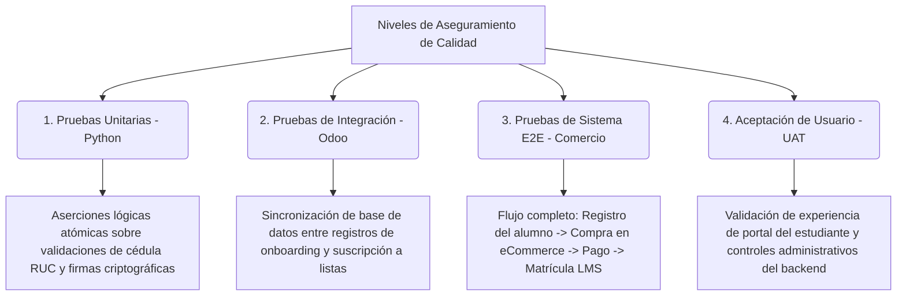

# 🧪 Plan de Pruebas Integradas y de Aceptación (UAT) - Academia Virtual de Tecnología

Este documento define la estrategia global, niveles de prueba, metodologías de aseguramiento de calidad (QA) y la matriz de cobertura de pruebas funcionales diseñada para validar el ecosistema de software de la **Academia Virtual de Tecnología** (Odoo-DAS v18.0).

---

## 🗺️ 1. Niveles y Metodologías de Pruebas

Para garantizar la robustez empresarial de la plataforma, el plan de aseguramiento de calidad se divide en cuatro niveles de pruebas continuas:

1.  **Pruebas Unitarias (`unittest`)**: Ejecutadas en aislamiento para verificar la validez de los algoritmos de codificación. No tocan la base de datos de producción (usando transacciones revertidas automáticamente).
2.  **Pruebas de Integración**: Evalúan la interoperabilidad de Odoo-DAS con servicios externos, como las llamadas SOAP a los web services offline del SRI y la lectura del almacén PKCS12.
3.  **Pruebas de Sistema (End-to-End)**: Validan el flujo de negocio completo desde la perspectiva del navegador web, simulando clics del carrito, checkout, inyección de RUC y redirecciones del onboarding.
4.  **Pruebas de Aceptación de Usuario (UAT)**: Pruebas visuales y funcionales realizadas por los roles clave del proyecto (Instructor, Analista Financiero, Coordinador Académico) para validar que la interfaz se comporta bajo el estándar requerido.

---

## 📈 2. Matriz de Cobertura y Trazabilidad

A continuación, se detalla la correspondencia entre los requerimientos del negocio de la Academia Virtual de Tecnología y las pruebas automatizadas implementadas:

| ID Requerimiento | Componente Evaluado | Tipo de Prueba | Archivo de Código Asociado | Casos Verificados en Código |
| :--- | :--- | :--- | :--- | :--- |
| **REQ-LMS-01** | Inscripción del estudiante | Unitaria | `test_das_lms_enrollment_flow.py` | `test_das_lms_enroll_partner_idempotent`, `test_skip_context_prevents_channel_partner_creation` |
| **REQ-LMS-02** | Control de carrito multicurso | Integración | `test_das_lms_enrollment_flow.py` | `test_sale_order_blocks_two_lms_products` |
| **REQ-LMS-03** | Límite de cantidad = 1 | Integración | `test_das_lms_enrollment_flow.py` | `test_sale_order_blocks_qty_gt_one_on_lms_line` |
| **REQ-LMS-04** | Fechas y modalidades LMS | Unitaria | `test_slide_channel_academic.py` | `test_das_total_hours_compute`, `test_das_dates_constraint`, `test_das_hours_non_negative`, `test_enrollment_modality_from_channel`, `test_modality_selection_labels_renamed` |
| **REQ-LMS-05** | Control de acceso temporal | Integración | `test_slide_channel_academic.py` | `test_das_academic_status_proximo_and_can_study`, `test_das_academic_status_finalizado_blocks_new_member`, `test_portal_lesson_access_proximo_member_blocked` |
| **REQ-ONB-01** | Onboarding de portal | Integración | `test_email_preferences.py` | `test_user_creation_creates_preference_draft`, `test_submit_preferences_success`, `test_submit_without_interests_raises`, `test_submit_always_uses_email_channel`, `test_submit_expert_experience_level` |
| **REQ-ONB-02** | Exención de onboarding | Unitaria | `test_email_preferences.py` | `test_admin_user_exempt_from_onboarding`, `test_internal_user_exempt_from_onboarding` |
| **REQ-MKT-01** | Runner de Campañas | Integración | `test_email_campaigns.py` | `test_birthday_campaign_idempotent`, `test_preference_completion_syncs_all_segment_lists`, `test_frequency_blocks_monthly_user_on_weekly_newsletter`, `test_monthly_user_receives_monthly_newsletter_only`, `test_cron_daily_executes_birthday_and_upcoming`, `test_upcoming_idempotent_per_course` |
| **REQ-BASE-01**| Identificación Nacional | Unitaria | `test_identity.py` | `test_valid_ruc_natural`, `test_valid_ruc_private`, `test_valid_cedula`, `test_invalid_length`, `test_invalid_mod10`, `test_pasaporte` |
| **REQ-SRI-01** | Firma Digital XAdES-BES | Integración | `test_sri_signer.py` | `test_01_certificate_loading`, `test_02_xml_canonicalization`, `test_03_sha1_digest`, `test_04_rsa_sha1_signature`, `test_05_full_signing_flow` |
| **REQ-SRI-02** | Conector SOAP SRI | Integración | `test_sri_service.py` | `test_01_wsdl_loading_reception`, `test_02_wsdl_loading_authorization`, `test_03_send_invalid_document`, `test_04_check_nonexistent_authorization` |

---

## ⚙️ 3. Entorno de Control de Calidad (QA Environment)

Para asegurar la validez de los resultados, las pruebas de software se corren sobre un entorno controlado de integración continua:

*   **Motor de Base de Datos**: PostgreSQL 15, aislado en un contenedor independiente con parámetros óptimos de lectura.
*   **Aislamiento de Datos**: Cada ejecución de `TransactionCase` crea un punto de guardado (Savepoint) en la base de datos de Odoo antes del test y ejecuta un rollback total al finalizar. Esto permite correr las pruebas de forma repetida sin dejar registros de prueba en la base de datos real.
*   **Simulación de Red**: Las pruebas de integración con el SRI (`test_sri_service.py`) detectan automáticamente la disponibilidad de red. Si no hay conexión o los servidores del SRI están caídos, la suite de pruebas marca los casos de red como "Skipped" (omitidos) en lugar de fallados, garantizando la estabilidad de los builds.
