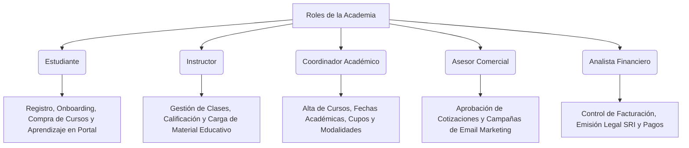

# 📖 Manual de Usuario e Instructor - Academia Virtual de Tecnología (Odoo-DAS)

Bienvenido al manual oficial de la **Academia Virtual de Tecnología**. Este documento describe en profundidad el catálogo comercial de cursos, los roles del sistema y los flujos de tareas paso a paso que realizan tanto los estudiantes como los instructores en nuestra plataforma integrada Odoo 18.0.

---

## 🗂️ 1. Catálogo Real de Cursos (Oferta Académica)

La Academia cuenta con **10 cursos reales** publicados en la tienda en línea (eCommerce) y vinculados a aulas virtuales del LMS. Cada curso está diseñado con precios, modalidades y temáticas de TI específicas:

| Nombre Comercial | Código Interno | Modalidad Académica (Sitio Web) | Duración Total (Horas) | Precio Base (USD) | Categoría de Estudio |
| :--- | :---: | :---: | :---: | :---: | :---: |
| **Auditoría de Sistemas de Información** | `AUDITORIA` | Virtual (Grabado) | 145.33 hrs | $100.00 | Auditoría / Seguridad |
| **Desarrollo Asistido por Software** | `ASISTIDO` | Híbrido (Mixto) | 93.00 hrs | $80.00 | Desarrollo |
| **Gestión de Calidad del Software** | `CALIDAD` | Presencial (En Vivo) | 144.00 hrs | $75.00 | QA / Testing |
| **Gestión de Proyectos de Software** | `PROYECTOS` | Presencial (En Vivo) | 144.22 hrs | $85.00 | Gestión / Scrum |
| **Inteligencia Artificial** | `IA` | Virtual (Grabado) | 96.27 hrs | $120.00 | IA / Data Science |
| **Bases de Datos** | `BASES` | Virtual (Grabado) | 109.05 hrs | $90.00 | Bases de Datos |
| **Ingeniería de Software** | `INGENIERIA` | Híbrido (Mixto) | 96.00 hrs | $85.00 | Desarrollo |
| **Sistemas Operativos** | `SISTEMAS` | Virtual (Grabado) | 90.00 hrs | $80.00 | Sistemas |
| **Patrones de Software** | `PATRONES` | Virtual (Grabado) | 90.00 hrs | $85.00 | Desarrollo |
| **Desarrollo de Aplicaciones Web y Móviles** | `WEB` | Híbrido (Mixto) | 110.00 hrs | $95.00 | Desarrollo |

---

## 👥 2. Perfiles y Roles del Ecosistema

El sistema segmenta las responsabilidades de la Academia en **5 roles principales** configurados en el backend y frontend de Odoo:

---

## 🎒 3. Flujo de Tareas de Extremo a Extremo (E2E) del Estudiante

A continuación, se detalla paso a paso el viaje completo que realiza un estudiante de la Academia Virtual de Tecnología, desde su registro hasta la obtención del material de estudio.

### Paso 3.1: Registro e Inicio de Sesión
1.  El usuario ingresa al portal web de la Academia (`http://localhost:8070`).
2.  Hace clic en el botón superior derecho **"Iniciar sesión"** y luego en la opción **"¿No tiene una cuenta? Regístrese"**.
3.  Ingresa sus datos básicos (Nombre, Correo Electrónico y Contraseña) y confirma su registro.

### Paso 3.2: Completar Onboarding Mandatorio de Preferencias
*   Inmediatamente tras el registro, el sistema detecta que el usuario no tiene registradas sus preferencias académicas.
*   Se activa la redirección forzada y se le presenta al alumno el formulario interactivo **"Academia Virtual - Onboarding de Preferencias"**.

*(Referencia visual del Formulario: [onboarding_form.png](file:///c:/Users/johan/OneDrive/Documentos/Universidad/Desarrollo%20Asistido%20por%20Software/OdooLeonel/Odoo-DAS/docs/images/onboarding_form.png))*

*   **Campos Requeridos**:
    *   **Áreas de Interés**: Selección múltiple de las materias deseadas (Desarrollo, QA, Auditoría, Gestión, etc.).
    *   **Cumpleaños**: Requerido en formato `DD/MM/AAAA` para la automatización de felicitaciones y promociones anuales.
    *   **Nivel de Experiencia**: Selección de su nivel técnico actual (Principiante, Intermedio, Experto).
    *   **Frecuencia**: Elige cada cuánto recibir comunicaciones (Semanal, Mensual o Nunca).
    *   **Aceptación Legal**: Casilla obligatoria de lectura y conformidad con los términos y políticas de privacidad de datos de la Academia.
*   Al pulsar **"Enviar Preferencias"**, el bloqueo se libera, se inscribe automáticamente al estudiante en los segmentos de Email Marketing y se le da acceso al portal.

---

### Paso 3.3: Explorar el Catálogo y Usar Filtros en la Tienda
1.  El estudiante hace clic en la pestaña **"Tienda"** del menú superior.
2.  En el panel izquierdo, puede aplicar **filtros por categoría** (ej. seleccionar "Desarrollo" para ver únicamente cursos de programación como *Desarrollo Asistido por Software*, *Ingeniería de Software*, etc.).
3.  Visualiza los precios en dólares (USD) y lee la descripción del curso de su elección.

---

### Paso 3.4: Agregar al Carrito y Reglas Académicas (Validaciones)
1.  El estudiante hace clic en el curso de su interés, por ejemplo, **Auditoría de Sistemas de Información**, y presiona el botón **"Agregar al carrito"**.
2.  **Validación Académica de Carrito Único**:
    *   Si el alumno intenta regresar a la tienda y agregar un segundo curso (ej. *Inteligencia Artificial*) mientras el primero está en el carrito, el sistema detendrá el proceso de forma inmediata, arrojando una alerta visual en pantalla.

*(Referencia visual del Error de Carrito: [lms_cart_error.png](file:///c:/Users/johan/OneDrive/Documentos/Universidad/Desarrollo%20Asistido%20por%20Software/OdooLeonel/Odoo-DAS/docs/images/lms_cart_error.png))*

> [!CAUTION]
> **Mensaje de Alerta**: *"Restricción Académica: No se permite tener múltiples cursos en el carrito simultáneamente. Finalice su compra actual para continuar."* Esta regla evita que los estudiantes se sobrecarguen de materias en el mismo ciclo y asegura la consistencia de facturación.
>
> **Límite de Cantidad**: El sistema bloquea los botones de incremento de cantidad en el carrito para productos LMS, forzando la compra de exactamente **1 unidad**.

---

### Paso 3.5: Checkout e Identificación Fiscal Ecuatoriana (SRI)
1.  El estudiante avanza en la pasarela presionando **"Finalizar compra"**.
2.  En la pantalla de dirección de facturación, el estudiante debe llenar sus datos de contacto reales.
3.  **Campo Tipo de Identificación**:
    *   Selecciona entre **Cédula**, **RUC** o **Pasaporte**.
    *   **Cédula / RUC**: El sistema valida dinámicamente con los módulos matemáticos 10 y 11 que el número sea legítimo en Ecuador. Si ingresa un dígito erróneo, el formulario no le permitirá continuar.
4.  Presiona **"Guardar dirección"**.

---

### Paso 3.6: Confirmación del Pago (Métodos Admitidos)

La Academia Virtual de Tecnología admite dos métodos de pago totalmente integrados en la pasarela de compra de Odoo:

#### Opción A: Simulación de Pago (Método "Demostración")
1.  **Selección**: Utilizado principalmente para evaluaciones de QA, simulaciones en vivo en el aula y pruebas académicas rápidas.
2.  **Proceso**: El estudiante selecciona **"Demostración"** en el formulario de pago y presiona **"Pagar ahora"**.
3.  **Resultado**: El sistema confirma instantáneamente el pedido web, registra la transacción como exitosa, publica la factura en Odoo, la marca como **"Pagada"** e inscribe síncronamente al alumno en el curso LMS.

#### Opción B: Pasarela de Pagos Seguros con PayPal
1.  **Selección**: El método real para transacciones electrónicas internacionales. El estudiante selecciona **"PayPal"** en el listado de proveedores y hace clic en **"Pagar ahora"**.
2.  **Redirección**: El portal web redirige al estudiante de forma segura a la pasarela sandbox/producción de PayPal para procesar la transacción con su saldo o tarjeta de crédito.
3.  **Proceso de Conciliación y Sincronización de Odoo**:
    *   Una vez que PayPal procesa el cobro, el proveedor de pagos de Odoo recibe la notificación de callback (IPN / Webhook).
    *   El sistema procesa la transacción de pago (`payment.transaction`) en estado `done` (o `pending` temporal de PayPal).
    *   **Confirmación Automática**: Confirma síncronamente el pedido de venta (`sale.order`) pasándolo a estado de venta firme (`sale`).
    *   **Facturación Automática**: Crea y publica de inmediato la factura de cliente (`account.move` en estado `posted`) con los importes exactos y registra el pago completo, marcándola como **"Pagada"**.
    *   **Inscripción Inmediata**: Sincroniza al socio de Odoo con el curso e-Learning de destino, activando el acceso a las lecciones.
4.  **Confirmación Visual**: El estudiante es devuelto a la página de éxito `/shop/confirmation` de la Academia, donde Odoo renderiza una plantilla personalizada detallando las lecciones y cursos recién desbloqueados.

---

### Paso 3.7: Acceso Académico e Interacción con el LMS
1.  Una vez confirmado el pago, se activa el webhook de inscripción inmediata de `das_lms`.
2.  El estudiante es redirigido a su panel académico o puede hacer clic en la pestaña **"Cursos"** del menú.
3.  Visualiza el curso en el que se ha matriculado (ej. *Auditoría de Sistemas de Información*) y puede ver su porcentaje de avance, las secciones académicas y descargar los materiales de estudio cargados.

> [!WARNING]
> **Cursos con Fecha Futura (Estado Próximo)**: Si el curso adquirido tiene configurada una fecha de inicio futura, el estudiante verá el curso en su panel pero el botón de ingreso a las lecciones estará bloqueado con un candado visual hasta el día de inicio oficial de clases.

---

## 🎓 4. Flujo de Tareas del Instructor (Gestión Académica)

Los Instructores y Coordinadores de la Academia operan directamente desde el backend de Odoo:

### Paso 4.1: Crear y Configurar Cursos LMS
1.  El Instructor ingresa al módulo de **eLearning** en el menú de aplicaciones de Odoo.
2.  Hace clic en **"Nuevo"** para crear un canal de aprendizaje:
    *   **Nombre del Curso**: Título oficial alineado al currículo.
    *   **Producto Vinculado**: Selecciona el producto correspondiente de la tienda para habilitar su venta.
    *   **Modalidad Académica**: Selecciona entre **Virtual (Grabado)**, **Presencial (En Vivo)** o **Híbrido (Mixto)**.
    *   **Horas de Estudio**: Define las horas autónomas y de contacto docente (el sistema calcula automáticamente el total de horas académicas en base a la suma).
    *   **Fechas Académicas**: Configura obligatoriamente la fecha de inicio (`das_start_date`) y de finalización (`das_end_date`).

### Paso 4.2: Administrar Alumnos e Inscripciones
*   Desde la pestaña **"Miembros"** de cada curso, el instructor puede ver el listado de estudiantes inscritos, su última fecha de conexión y el progreso individual en las lecciones.
*   **Añadir Miembro Manualmente**: Si un estudiante realiza un pago por transferencia externa, el instructor puede agregarlo de manera manual.

> [!CAUTION]
> **Excepción de Curso Finalizado**: Si el instructor intenta agregar manualmente a un estudiante a un curso cuya fecha de finalización ya expiró, el sistema lanzará un mensaje de error deteniendo el proceso, ya que no se permiten inscripciones retrospectivas en periodos académicos cerrados.
